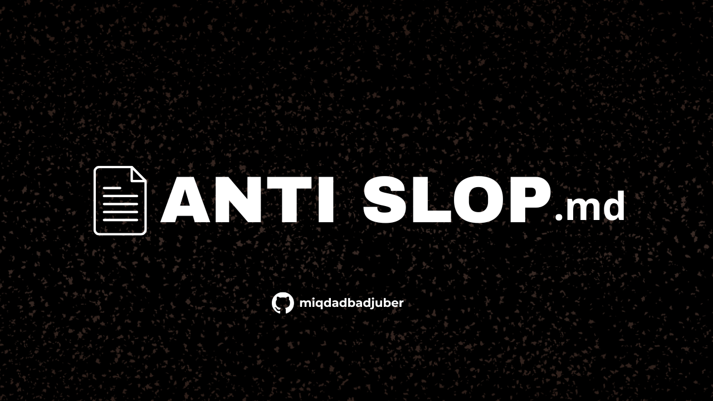

<p align="right">
  <a href="README-ID.md"></a>
  <a href="README.md"></a>
</p>

# Anti AI Slop: Design & Copy Rules



> Design rules to stop AI coding agents from generating generic UI ("AI slop"). Includes 32 enforceable rules and a ready-to-use pre-ship checklist.

---

## What Is This?

`ANTISLOP.md` is a specialist rules document for UI/UX design work, designed to be **read on-demand** by AI coding agents, not force-loaded into every session regardless of the task. The file contains:

- **Part 1:** Recognizable AI slop patterns (generic blue-purple gradients, excessive glassmorphism, marketing buzzwords, etc.)
- **Part 2:** 32 mandatory rules (R-01 to R-32) the agent must follow when producing a design
- **Checklist:** 32 verification questions, one per rule, for the agent to answer before a design is considered done

---

## Setup: The Router Pattern

Most projects using an AI coding agent already have an entry-point file (`AGENTS.md`, `CLAUDE.md`, `GEMINI.md`, etc.) that the agent **always** reads at the start of a session. That file usually holds general project info: stack, conventions, build/test commands.

`ANTISLOP.md` is **not** meant to be merged or copy-pasted into that entry-point file. Instead, keep `ANTISLOP.md` wherever your other rules files live (project root, `.agent/`, `.ai/`, or any similar directory), and add a **single pointer line** to your existing entry-point file (`AGENTS.md`, `CLAUDE.md`, `GEMINI.md`, etc.):

```md
## Design & UI
If the task involves building or editing UI/UX, read `ANTISLOP.md`
first before generating anything.
```

Why this pattern beats merging everything in:

- **Saves context:** hundreds of lines of design rules only get loaded when actually relevant, instead of bloating every non-UI/backend task
- **Easier to maintain:** updating `ANTISLOP.md` never requires touching the project's entry-point file
- **Portable:** the same `ANTISLOP.md` can be reused across projects by just copying the file and adding one pointer line

This pattern is **generic and tool-agnostic**. The pointer line above is a plain natural-language instruction that the agent executes using its own file-read tool, so it works identically in Claude Code, Codex, Cursor, Windsurf, or any other agent capable of reading a referenced file.

### Manual / one-off prompt

Don't want to set up any file? Copy the full contents of `ANTISLOP.md` and paste it at the start of your prompt before asking the agent to design something.

> **Warning:** This approach is less reliable than the router pattern. When a long block of rules is pasted into a chat rather than loaded as a native context file, agents are more likely to partially ignore or hallucinate past the instructions, especially as the conversation grows longer. Use it as a quick fallback, not a primary setup.

---

## How to Get the File

Download `ANTISLOP.md` directly from the command line:

```bash
curl -o ANTISLOP.md https://raw.githubusercontent.com/miqdadbadjuber/anti-slop/main/ANTISLOP.md
```

Or download the Indonesian version:

```bash
curl -o ANTISLOP-ID.md https://raw.githubusercontent.com/miqdadbadjuber/anti-slop/main/ANTISLOP-ID.md
```

Then place the file wherever your other agent rules files live.

---

## File Structure

```
ANTISLOP.md
├── Core Principle             # key question: "swap the logo, is it still unique?"
├── Part 1: Slop Patterns      # reference list of AI slop patterns (7 categories)
├── Part 2: Mandatory Rules    # R-01 to R-32, detailed rules per topic
└── Pre-Ship Checklist         # 32 verification questions, 1:1 with each rule
```

---

## Contributing

PRs are welcome for adding new AI slop patterns, clarifying ambiguous rules, or reporting checklist items that are out of sync with their corresponding rule.

---

## License

MIT — see [LICENSE](LICENSE)